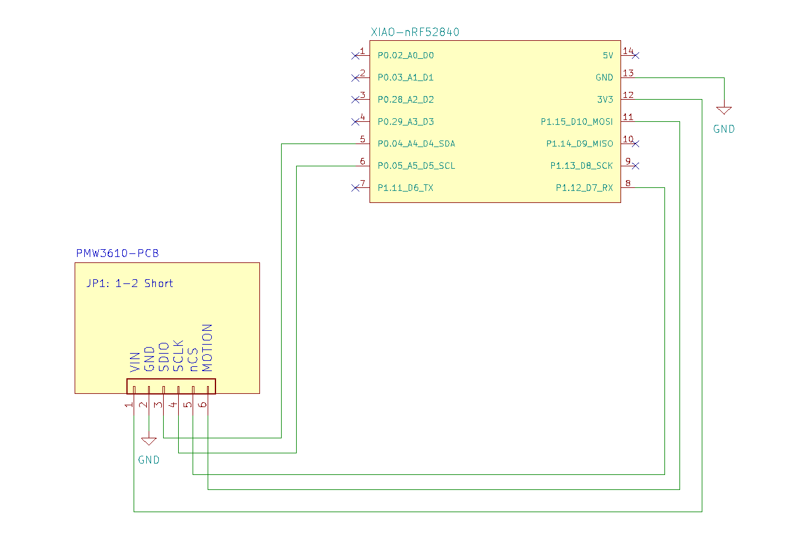

# pmw3610_pcb_check

This Arduino example tests the  [pmw3610-pcb](https://github.com/hidsh/pmw3610-pcb) breakout board by printing sensor data to the Serial monitor.

```
22:34:39.751 -> --- pmw3610-pcb-check ---
22:34:39.751 -> ✓ PMW3610: OK
22:34:48.913 -> dx:   0,  dy:  -1,  Quality:128
22:34:48.913 -> dx:   0,  dy:  -3,  Quality:122
22:34:48.913 -> dx:   1,  dy:  -4,  Quality:121
22:34:48.913 -> dx:   0,  dy:  -4,  Quality: 92
```

- board: seeeduino_xiao_ble (XIAO nRF52840) and other MCU breakout boards
- library: [Arduino PMW3610 driver (Bit banging)](https://github.com/shiranehyuga/PMW3610)

## Connection to XIAO nRF52840


## Pinout
|PMW3610-pcb  | XIAO|
|-----|:-----------|
|1 (VIN)  | 12 (+3.3V)      |
|2 (GND)  | 13 (GND)        |
|3 (SDIO) | 5 (D4)  |
|4 (SCLK) | 6 (D5)  |
|5 (nCS)  | 8 (D7)  |
|6 (MOTION)| 11 (D10) |

## Links
- [shiranehyuga/PMW3610](https://github.com/shiranehyuga/PMW3610)
- PMW3610 Breakout board: [pmw3610-pcb](https://github.com/hidsh/pmw3610-pcb) (Thanks to [siderakb](https://github.com/siderakb)!)
- Shop: [BOOTH](https://zzz-kbd.booth.pm/items/7066618)
